# Missile CMD

A pocket-sized missile-defense arcade game for Flipper Zero, inspired by the tension and clarity of classic command-center games.

[](https://github.com/LTDev-LLC/Missile-CMD/actions/workflows/release.yml?query=branch%3Amain)

| Firmware | Locked SDK |
| --- | --- |
| Official | [1.4.3](https://github.com/flipperdevices/flipperzero-firmware/releases/tag/1.4.3) |
| Unleashed | [unlshd-092](https://github.com/DarkFlippers/unleashed-firmware/releases/tag/unlshd-092) |
| Momentum | [mntm-012](https://github.com/Next-Flip/Momentum-Firmware/releases/tag/mntm-012) |

## Gameplay

- Defend six cities and three missile batteries through increasingly dense waves of standard, fast, splitting, and evasive missiles.
- Build defensive chain reactions and spend credits between waves on repairs, extra ammunition, larger defensive blasts, faster interceptors, or longer-lived explosions.
- From wave 10 onward, face a deterministic director that announces Barrage, Velocity, Fast Swarm, Fracture, Focus Fire, or Overload before the next attack.
- Save at safe points and resume the exact active wave, wave result, or repair state later.
- Practice a failed wave from its original starting cities, ammo, upgrades, and random state.
    - These single-wave retries preserve the original mode rules and do not update records or suspended saves. Existing saves remain loadable; saves without replay data gain exact practice at the next wave.
- Track five high scores per difficulty plus overall personal records for score, wave, survival time, qualifying accuracy, chain depth, and perfect-wave streak.
- Earn 15 cosmetic medals, track progress, and pin a goal from Records & Medals.
- Practice in four interactive lessons and play daily or shared-seed challenges.

## Modes and challenges

| Mode | Rules |
| :--- | :--- |
| Classic | Standard six-city defense with a fresh seed. |
| Daily | A shared seed for the day on your device clock, at Command difficulty. |
| Seeded | Enter an eight-digit hexadecimal seed to share a challenge. |
| Limited ammo | Start each wave with five shots per surviving battery. |
| One city | Defend one city; the other five cannot be rebuilt. |
| Barrage | Much shorter intervals between enemy launches. |
| Perfect defense | Losing any city or battery immediately ends the run. |
| Endless Crisis | Start at wave 10 on Crisis difficulty. |
| Training | Four repeatable, action-gated lessons: interception, chains, battery selection, then repairs and supplies. |
| Practice | Start at waves 1-65,535; choose mixed, standard, fast, splitting, or evasive enemies; toggle unlimited ammo, half speed, and aiming aids. No records or suspended save. |
| Campaign | Five missions with Standard, Barrage, Velocity, Fracture, and Focus Fire rules, ending in victory. |
| Score attack | Three minutes of simulation time, with a separate mode best. Pause/workshop time is excluded. Losing every city ends the attempt early. |
| Puzzles | Nine authored formations, two center-battery shots, completion tracking per difficulty, and optional hints. Victory requires intercepting every threat, including split children, without any ground impact. Choose a puzzle in mode options. |
| Two players | Pass the device after player one's attempt. Both players receive the same five missions, seed and difficulty. Compare score, survival and accuracy; tied scores draw. Sessions are not suspended or entered in records. |
| Evasive | Standard missiles become marked evasive missiles that change their target once during flight. |

## Controls

- **D-pad:** move the targeting cursor with smooth hold acceleration, or navigate menus. A guidance line connects the active battery to the crosshair.
- **OK:** fire from the selected battery or confirm a menu choice.
- **Hold OK:** open direct battery selection. While holding, tap Left, Up, or Right for the corresponding battery, or Down for Auto. Release OK to close without firing. Destroyed batteries cannot be selected; a locked empty battery refuses the shot.
- **Back:** pause during a wave; return or continue on other screens.
- **Long Back:** open the save-and-return confirmation during a run; Practice and Two players instead offer to end the session.

## Gameplay readouts

For example, the top bar might show `W10 012450 H25000 A09`, and the bottom bar `T24 L10 C9 R9`.

| Position | Label / example | Meaning |
| --- | --- | --- |
| Top | `W10` | Current wave: 10. |
| Top | `012450` | Current run's score: 12,450 points. This number has no letter prefix. |
| Top | `H25000` | Matching mode best, or the difficulty-table best for Classic/Seeded: 25,000 points. |
| Top | `A09` | **Auto** battery selection; the automatically selected battery has 9 shots left. Auto picks the closest living battery with ammo to the crosshair horizontally. |
| Top | `L09`, `C09`, `R09` | Manual selection of the **Left**, **Center**, or **Right** battery, followed by its remaining shots. `00` means that selected battery is empty. |
| Top | `A--` | No battery is available to fire. The dashes replace the ammo number. |
| Bottom | `T24` | 24 threats remain in this wave: missiles currently flying **plus** those still waiting to spawn. Splitting missiles can change this count. |
| Bottom | `L10 C9 R9` | Shots remaining in the **Left**, **Center**, and **Right** batteries, respectively. An empty or destroyed battery shows `0`. |
| Bottom | `LOW` | At most **3 shots total** remain across all batteries, including zero. |

## Settings

- Sound and vibration
- Slow, Normal, or Fast cursor movement
- Adaptive rendering (up to 30 FPS, idling when unchanged)
- Battery Saver rendering (15 FPS cap while simulation remains 30 Hz)
- **Display → Invert colors:** swap foreground and background throughout the app; the preference is saved (off by default)
- Reduced flash and control-card preferences
- Missile tails on/off for incoming missiles and fired interceptors (on by default)
- Cursor acceleration on/off and a bold targeting cursor
- Light or Normal vibration intensity, independently of vibration on/off

## LED Notifications

| Event | LED alert |
| --- | --- |
| Interceptor detonation, chain reaction, or impact on rubble | One short yellow flash |
| City or battery destroyed | Two red flashes |
| Game over | Three red flashes |
| Wave cleared | Two green flashes |


## Screenshots

| Title menu | Run setup | Active gameplay |
| :---: | :---: | :---: |
| 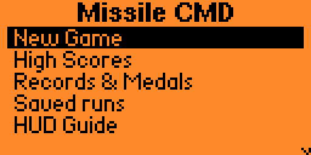 | 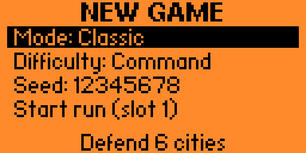 | 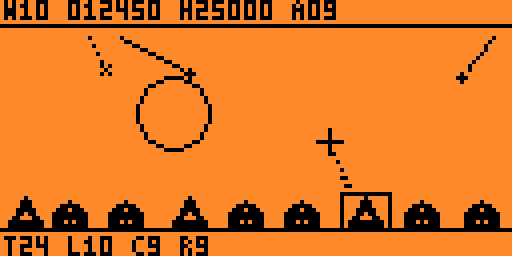 |
| **Late-wave gameplay** | **Practice aiming** | **Simple HUD** |
| 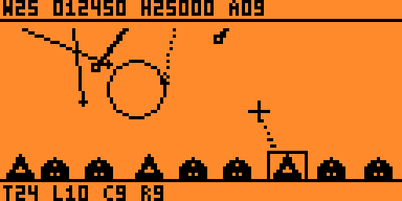 | 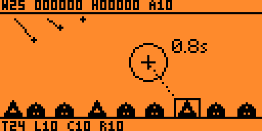 | 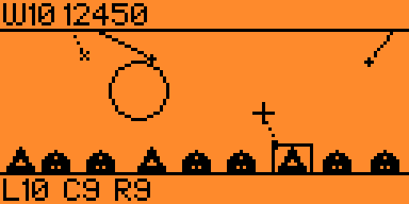 |
| **Wave complete** | **Repairs** | **Training** |
| 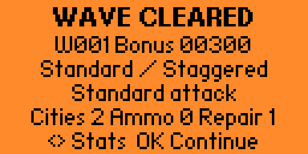 | 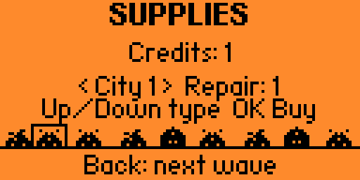 | 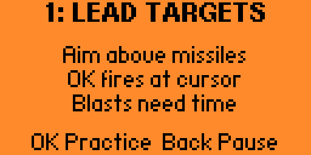 |
| **Game over** | **High scores** | **Medals** |
| 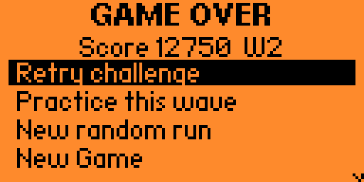 | 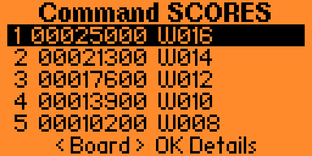 | 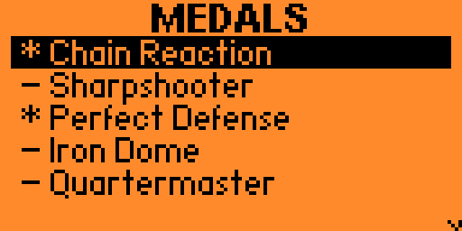 |

## Install Missile CMD

### USB web installer

The [web installer](https://LTDev-LLC.github.io/Missile-CMD/) offers a release dropdown and
Official, Unleashed, or Momentum builds available for that release. Use desktop Chrome
or Edge, connect your Flipper with a USB data cable, and close qFlipper and the game first.
Connect the device, review the firmware compatibility, then choose **Install Missile CMD**.
The installer copies the app and matching help file (when that release includes one),
checks both on the microSD card, and releases USB. Open **Apps → Games → Missile CMD**.
Each release uses `apps_data/missile_cmd/<VERSION>/` for its help, settings, saves,
scores, profile, and pace history. Existing data stays in its original folder;
installing a different release starts with that release's own saved data or defaults.

Older releases without help remain installable as app-only releases. Their FAP API is
shown, but firmware versions are marked unrecorded rather than inferred from the current
SDK lock. Unknown firmware compatibility requires you to check the build yourself; a
detected firmware-family or API-major mismatch blocks installation. You can also download
the files directly when your browser does not support Web Serial.

The installer stages and checks both files before replacement, and restores the originals
if replacement fails while USB is still available. If power or USB is lost during final
replacement, `.web-backup` files retain the originals beside the app/help. Use qFlipper to
restore each backup to its original name (keep a local copy first); reconnect and retry.
Stale `.web-install` staging files are safely replaced on the next attempt.

### Requirements

- Flipper Zero with a microSD card
- Official, Unleashed, or Momentum firmware matching the SDK used to build the app
- A USB cable for developer installation

Download the ZIP matching your firmware and copy its `apps` and `apps_data` folders to the SD-card root. It contains `apps/Games/missile_cmd.fap` and `apps_data/missile_cmd/<VERSION>/help.bin`. The folder name is the exact value in `VERSION`, including any prerelease or build suffix. Then open **Apps → Games → Missile CMD**.

Standalone firmware-specific FAPs remain available; `missile_cmd.fap` is the Official release alias. The matching `help.bin` release asset supplies HUD explanations, lesson instructions, puzzle hints, medal criteria, debrief tips, and mode descriptions. Copy it into that release's data folder. The ZIP, USB uploader, and web installer do this automatically.

The build generates the app version and data paths from `VERSION`; there is no separate
data-directory version setting. Help is generated locally as `dist/<VERSION>/help.bin`.
The app can offer to purge other SemVer release folders and legacy numeric folders at
startup. Choose **Keep** to retain them; the active release's folder is always excluded.

### Build and install

```sh
python3 -m venv .venv
source .venv/bin/activate
python -m pip install --require-hashes -r requirements-build.txt
make build
```

Official is the default. Choose the firmware installed on your Flipper:

| Firmware | Build |
| --- | --- |
| Official | `make build` |
| Unleashed | `make build FIRMWARE=unleashed` |
| Momentum | `make build FIRMWARE=momentum` |

Builds use the SDK versions and archive checksums in [`build-lock.json`](build-lock.json), uFBT 0.2.6, and toolchain 39. The first build downloads the selected archive; later builds verify the cached archive and every publisher-provided SDK file before reusing them. A modified SDK tree is restored from the verified archive.

`make sdk-update FIRMWARE=unleashed` reinstalls that firmware's locked SDK, and `make sdk-status FIRMWARE=unleashed` reports the installed version and API. To override the lock locally, set an explicit release such as `SDK_VERSION=unlshd-092`. To fetch the newest release, use `make sdk-update FIRMWARE=unleashed SDK_VERSION=latest`; use `SDK_VERSION=latest` on subsequent commands to keep using that override. Defaults always return to the committed lock.

SDKs and build caches are isolated under `~/.cache/missile-cmd/ufbt/<firmware>`; set `SDK_ROOT` to change the parent directory. The compiler toolchain is shared from `~/.ufbt`, or `FBT_TOOLCHAIN_PATH` if set. Project `.env` files must not override those selected paths. These make targets run on macOS and Linux.

`make build-all` builds all three targets in sequence. `make repro-check FIRMWARE=official` compares two clean builds, including packed FAPs, help files, and deterministic ZIP bundles, and records their hashes; it also supports the other two targets. Packed files are named `dist/missile_cmd-official.fap`, `dist/missile_cmd-unleashed.fap`, and `dist/missile_cmd-momentum.fap`. `dist/missile_cmd.fap` contains the most recent build. Each target's release, API, SDK and toolchain archive checksums, tool versions, and separate FAP/help/combined-installed size report is saved under `build_metadata/<firmware>/`.

Connect a Flipper Zero over USB to build, upload, and launch the matching packed app:

```sh
make install                      # Official
make install FIRMWARE=unleashed
make install FIRMWARE=momentum
```

### Core tests

```sh
make test
make test TEST_SANITIZERS='-g -O1 -fno-omit-frame-pointer -fsanitize=address,undefined'
make screenshots-check
make lint
make format
```
## Releases

The current release version is stored in [`VERSION`](VERSION) as SemVer. Every push to `main` runs the **Release** pipeline: validate the version, run tests, build and lint all three firmware targets, publish a release when `VERSION` changes, then publish the Pages installer. A failed build, test, or release blocks Pages. Other pushes refresh the installer after checks without creating another release. Branch pushes, pull requests, and scheduled SDK checks still use the **Build and test** workflow. Releases include the three firmware-specific FAPs, matching deterministic ZIP bundles, the optional help file, and `missile_cmd.fap` as an alias for the Official build.

Releases also include `install-manifest.json`, generated from the verified build reports.
Its schema 2 records the app version, versioned data directory, actual firmware SDK
versions, FAP APIs, installation paths, and SHA-256 hashes for each app/help pair. The web
installer uses the selected release's manifest rather than the site's current `VERSION`,
so older and newer releases always install help into their own matching folders.

### Publishing the web installer

In repository **Settings → Pages**, set **Source** to **GitHub Actions**. Pages runs as
the final stage of the **Release** pipeline, after the build, tests, and any new release
have succeeded. It uses the same source commit that passed the checks. Main pushes and
release edits/publication/deletion run this pipeline; Pages has no independent trigger.
To refresh after uploading assets to an existing release, manually run **Release** on
`main` with **Publish VERSION as a release** unchecked. Leave it checked only when
publishing an unused version. Releases created with `GITHUB_TOKEN` proceed directly to
Pages within the same run. No external server or browser GitHub token
is required. All releases are paginated and mirrored into the Pages artifact, avoiding
cross-origin restrictions on GitHub release downloads; prereleases are labeled and the
newest stable release is selected by default.

For a private repository, the Actions token downloads release assets during the build.
**A public Pages deployment makes the mirrored app/help binaries public even when the
source repository is private.** Enable publishing only with that distribution intent;
private-repository Pages also requires a GitHub plan that supports it. GitHub release
notes and source links still require repository access.

For local development, with Node.js 22+ and an authenticated GitHub CLI:

```sh
make web-test
python3 tools/build_pages.py
python3 -m http.server 8000 --directory build/pages --bind 127.0.0.1
```

Open `http://localhost:8000`. The generator requires an empty output directory; remove
only the generated `build/pages` directory before rebuilding, or supply a fresh
`--output` directory. The site uses plain HTML/CSS/JavaScript with no runtime dependencies.
Download integrity uses SHA-256; on-device verification uses the storage CLI's MD5 and
file size. The stream tests simulate split responses, failed uploads, and disconnections;
a real USB installation is still required to validate browser/firmware combinations.

## License

Copyright (c) 2026 LTDev LLC. Source code and original project assets are licensed under the MIT License; see [`LICENSE`](LICENSE). Bundled host-renderer font data is covered by its [separate licenses](tests/FONT_LICENSES.md). The implementation uses the public official firmware API and does not copy third-party arcade assets.
